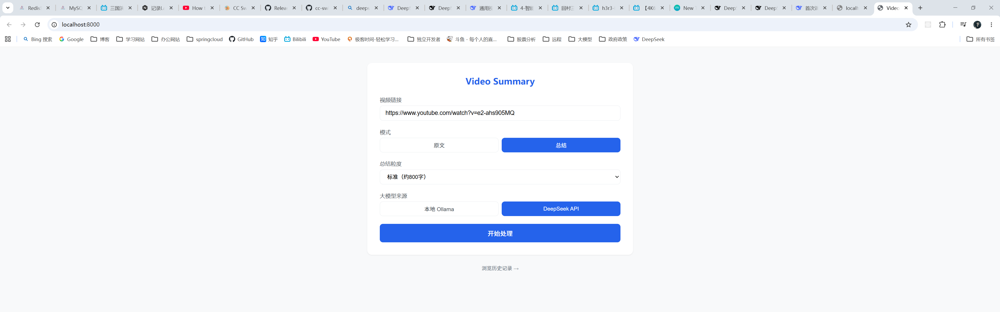
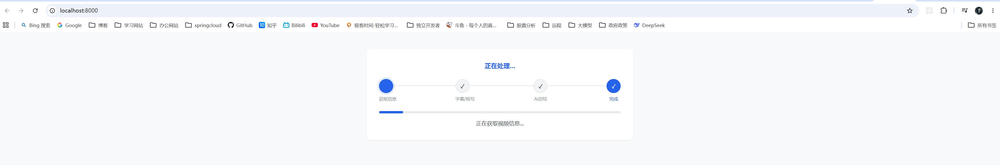
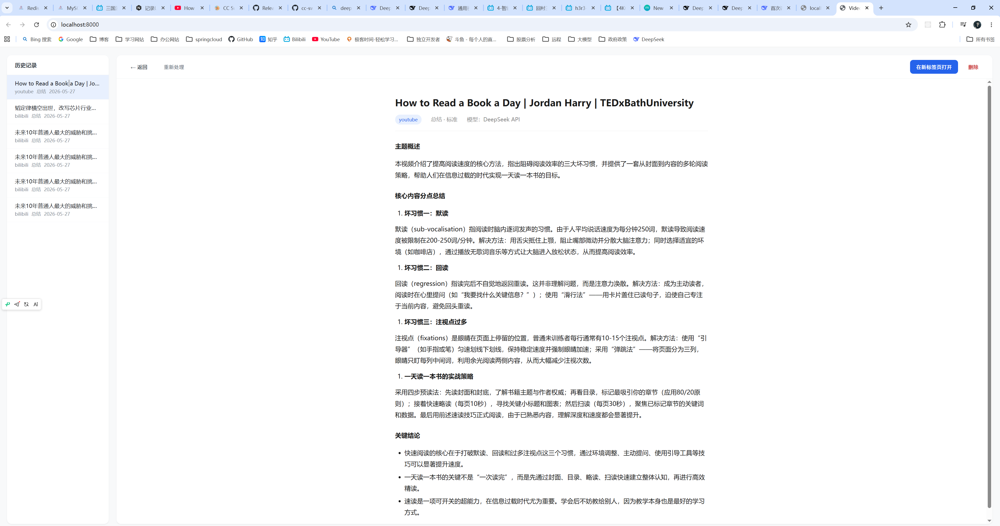

# Video Summary

本地运行的视频内容提取与 AI 总结工具。输入视频 URL，自动获取字幕或下载音频进行 Whisper 语音转写，可选调用大模型生成中文摘要，最终输出排版整齐的 HTML 结果页。

## 功能

- **多平台支持**：B站（API 直连）、YouTube、以及 yt-dlp 覆盖的主流视频平台
- **双模式**：原文转录 / AI 总结
- **Whisper 本地转写**：无字幕视频自动下载音频，本地 Whisper base 模型转写
- **双 LLM 后端**：本地 Ollama 或 DeepSeek API，按需切换
- **三级总结粒度**：简洁（~200字）、标准（~800字）、详细（~2000字）
- **实时进度**：SSE 推送处理进度，前端实时展示步骤和百分比
- **历史管理**：所有结果自动保存，支持浏览、预览、删除

## 效果展示

<!-- 替换为你的截图 -->

### 首页 - 输入URL


### 处理进度


### 总结结果


### 服务器日志


## 技术栈

| 层 | 技术 |
|---|---|
| 后端框架 | FastAPI + Uvicorn |
| 视频下载 | yt-dlp |
| 语音转写 | OpenAI Whisper (base) |
| 大模型 | Ollama (本地) / DeepSeek API |
| 前端 | 原生 HTML/CSS/JS，SSE 实时通信 |
| 输出 | HTML 渲染，Markdown → HTML 转换 |

## 前置条件

1. **Python 3.10+**
2. **FFmpeg** — yt-dlp 音频提取需要，[下载地址](https://ffmpeg.org/download.html)，确保加入 PATH
3. **Ollama**（可选，使用本地模型时需要）— [下载地址](https://ollama.com/)
4. **DeepSeek API Key**（可选，使用 API 总结时需要）

```bash
# 如果用本地 Ollama，先拉取模型
ollama pull deepseek-r1:8b
```

## 安装

```bash
git clone https://github.com/your-username/video-summary.git
cd video-summary

pip install -r requirements.txt
```

## 配置

复制 `.env` 文件并按需修改：

```env
# DeepSeek API（使用 API 总结时需要）
DEEPSEEK_API_KEY=sk-your-key-here
DEEPSEEK_BASE_URL=https://api.deepseek.com
DEEPSEEK_MODEL=deepseek-v4-flash

# Ollama 本地（默认）
OLLAMA_BASE_URL=http://localhost:11434
OLLAMA_MODEL=deepseek-r1:8b

# 结果输出目录
OUTPUT_DIR=D:\\video-summary-output
```

如果使用代理访问外网（YouTube 等），在 `backend/services/video_service.py` 中修改 proxy 地址：

```python
"proxy": "http://127.0.0.1:7892",  # 改为你的代理端口
```

## 使用

```bash
python -m backend.main
```

浏览器打开 `http://localhost:8000/`，粘贴视频链接，选择模式，点击"开始处理"。

## 项目结构

```
video-summary/
├── backend/
│   ├── main.py                    # FastAPI 入口，路由，流水线
│   ├── config.py                  # 环境变量读取
│   ├── models/
│   │   └── schemas.py             # Pydantic 数据模型
│   ├── services/
│   │   ├── video_service.py       # 视频信息提取、字幕、音频下载
│   │   ├── whisper_service.py     # Whisper 本地语音转写
│   │   ├── llm_service.py         # Ollama / DeepSeek API 总结
│   │   ├── html_renderer.py       # Markdown → HTML 渲染
│   │   └── history_service.py     # 历史记录存取
│   └── utils/
│       └── sse_manager.py         # 线程安全的任务状态存储
├── frontend/
│   └── index.html                 # 单页前端（输入、进度、结果、历史）
├── screenshots/                   # 效果截图（替换为实际图片）
├── .env                           # 环境配置
├── requirements.txt               # Python 依赖
└── README.md
```

## 处理流程

```
输入 URL
  ├─ 1. 提取视频信息（B站走 API，其他走 yt-dlp）
  ├─ 2. 尝试获取字幕（B站 API → yt-dlp 兜底）
  │     ├─ 有字幕 → 跳到步骤 4
  │     └─ 无字幕 ↓
  ├─ 3. 下载音频（64kbps 低码率 + 8 路并行）→ Whisper 转写
  ├─ 4. 原文直接渲染 / 总结模式调 LLM
  └─ 5. 生成 HTML → 保存到历史
```

全程通过 SSE 向前端推送实时进度。

## 注意事项

- **首次运行 Whisper** 会自动下载 `base` 模型（~142MB），缓存在 `~/.cache/whisper/`，后续复用
- **B站视频** 优先使用官方 API 获取标题和字幕，速度快且不需要代理
- **YouTube** 需要代理访问，下载速度受代理带宽影响。已启用 64kbps 低码率 + 8 路并行分片下载来优化速度
- 临时文件（下载的音频等）在每次处理完成后自动清理，服务启动时也会清理 yt-dlp 缓存和历史遗留临时目录
